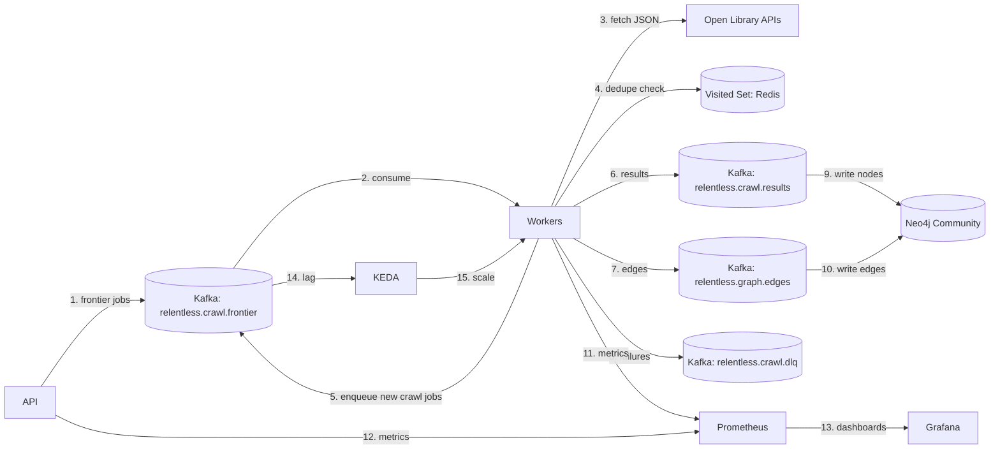
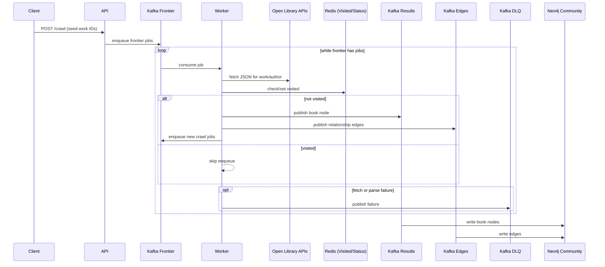
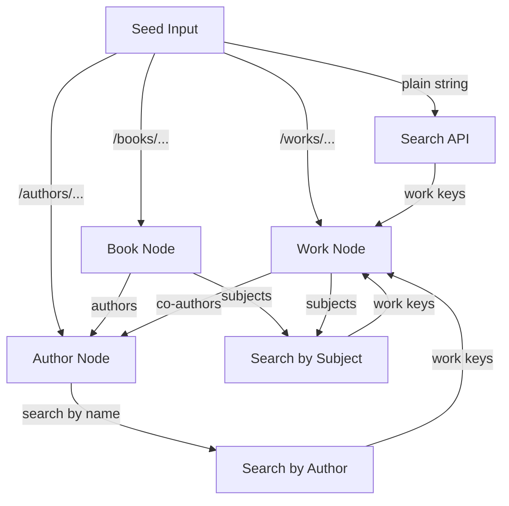
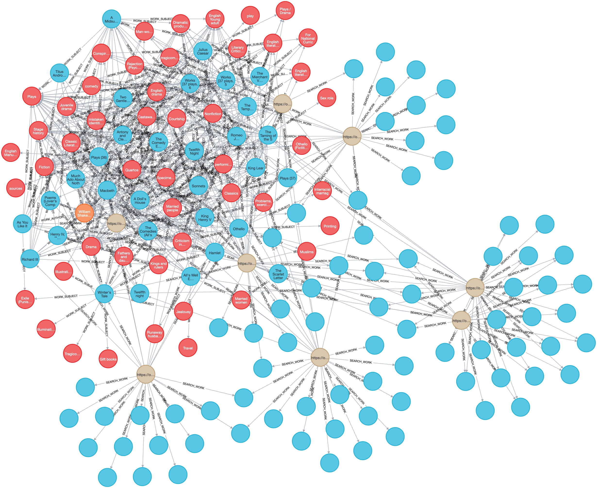
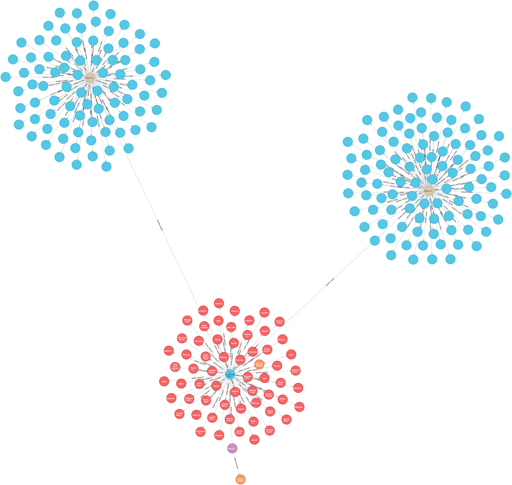

# Relentless Bookworm

## Overview

Relentless Bookworm crawls Open Library starting from one or more seeds (books,
works, authors, or search queries), discovers related works, and builds a graph
of books and their relationships.

## Goals

- Crawl related books (same author, same subjects, similar works).
- Build a graph of books and relationships.
- Scale workers and graph writers based on Kafka lag and other metrics.

## Architecture

This project focuses on a distributed Open Library book graph crawler that:

- Accepts one or more seeds (works, authors, editions, or search queries) as crawl entry points.
- Traverses related works via authors, subjects, and similar works.
- Emits a directed graph of book nodes and relationship edges.

- **API service** receives crawl requests, validates seeds, and enqueues jobs.
- **Worker service** fetches Open Library data, dedupes, and emits nodes/edges.
- **Kafka topics** separate frontier, results, edges, and DLQ streams.
- **Deduplication store (Redis)** prevents re-crawling previously seen works/authors
  and persists crawl status.
- **Book graph database (Neo4j Community)** stores nodes and edges per session.
- **Decision**: use **Neo4j Community** for graph storage and **Redis** for dedupe.
- **Metrics and autoscaling** expose service health; KEDA scales workers on frontier lag and graph writers on edges lag.
- **Note on incomplete nodes**: edges are written as soon as they are discovered,
  so a node may appear with missing fields (like a title) until its own frontier
  job is processed and the full node payload is written.





## Node Types

We crawl and store three Open Library node types:

- **Books (editions)**: `/books/OL...M.json`
- **Works**: `/works/OL...W.json`
- **Authors**: `/authors/OL...A.json`

These node types map to distinct JSON shapes and are parsed into
`BookNode`, `WorkNode`, and `AuthorNode` respectively.

## Frontier Expansion Strategy

We expand the crawl frontier strictly within `openlibrary.org`:

For API endpoints and payload formats, treat the Open Library API docs as the
source of truth: `https://openlibrary.org/developers/api`.

1. **Plain string seed** → `search.json?q=seed` and enqueue returned work keys.
2. **Book (edition)** → add node, enqueue author keys from `authors[]`.
3. **Author** → run `search.json?author=NAME`, enqueue work keys, add edges.
4. **Work** → enqueue co-author keys from `authors[].author.key`.
5. **Subjects** → for each subject on a book or work, run
   `search.json?subject=SUBJECT` and enqueue work keys.



## Project Structure

- `cmd/`: entrypoints for API, worker, graph-writer, loadgen, and kafka-check binaries.
- `internal/`: core domain logic (crawler interfaces, models, Open Library parsing,
  Kafka producer, Neo4j graph writer, Redis status store).
- `deploy/`: Kubernetes manifests and Helm charts (Kafka, Redis, Neo4j,
  Prometheus/Grafana, KEDA, proxy, Chaos Mesh, API/worker/graph-writer).
- `scripts/`: cluster bring-up/teardown (helm_up/down, kind_up/down) and e2e helpers.
- `results/`: run-specific screenshots and analysis writeups.
- `raw_data/`: exported metrics and raw screenshots from Grafana.
- `mocks/`: gomock-generated mocks used in unit tests.
- `common/`: shared helpers.

## Sample Graph Output

**Single seed (author):** William Shakespeare.



**Single seed (book):** A Clockwork Orange.



**Three seeds (authors):** William Shakespeare, John Milton, Virginia Woolf.


## Observability

We use Prometheus + Grafana to understand crawler health, throughput, and backlogs.
Key signals and why they matter:

- **Frontier lag (Kafka)**: `kafka_consumergroup_lag` for
  `relentless.crawl.frontier` shows how far workers are behind the crawl queue.
  Drives KEDA autoscaling and highlights bottlenecks.
- **Worker replicas**: `kube_deployment_status_replicas_available` for
  `relentless-worker` shows KEDA scaling output.
- **Worker throughput**: `relentless_worker_jobs_success_total` rate tells us
  how fast the crawler is progressing through URLs.
- **Worker skip rate**: `relentless_worker_jobs_skipped_total` rate surfaces
  dedupe effectiveness and repeated seeds.
- **Worker failure rate**: `relentless_worker_jobs_failed_total` rate highlights
  fetch/parse errors and retry pressure.
- **Fetch latency**: `relentless_worker_fetch_latency_seconds_*` histogram
  captures Open Library response times (p50/p95).
- **Rate limit hits**: `relentless_worker_rate_limit_hits_total` counts Open Library
  HTTP 429 responses; useful when using a single egress (see results/ for multi-egress proxy pool).
- **Worker V2 in-flight**: `relentless_worker_in_flight` shows concurrent jobs
  per worker (bounded by CONCURRENT_JOBS).
- **Worker V2 commit pending**: `relentless_worker_commit_pending_total` shows
  messages awaiting ordered commit per partition.
- **Worker V2 commit errors**: `relentless_worker_commit_errors_total` rate
  surfaces Kafka commit failures.
- **Worker V2 commit latency**: `relentless_worker_commit_latency_seconds_*`
  histogram captures commit coordinator overhead.
- **Graph writer lag**: `kafka_consumergroup_lag` for results/edges topics shows
  whether Neo4j ingestion is keeping up.
- **Graph writer throughput**: `relentless_graph_writer_*_received_total` and
  `*_written_total` rates measure msgs into graph writer and persisted to Neo4j.
- **Results vs edges written**: comparing these rates helps detect gaps where
  edges are written before full node payloads arrive (missing titles).
- **Graph writer replicas**: `kube_deployment_status_replicas_available` for
  `relentless-graph-writer`.

### Results and Analysis

- **API metrics:** `GET /metrics` on port `8080`.
- **Worker metrics:** `GET /metrics` on `METRICS_ADDR` (default `:9090`).

The results docs tell how the worker evolved: **V1** (sync fetch, one job at a time) hit a throughput wall; **V2** (concurrent fetch + commit coordinator) gave ~5–8× edges/s; **V3** (KEDA autoscaling and chaos testing) validated scale and resilience; **V4** (proxy pool) spread traffic across egress IPs to avoid Open Library per-IP rate limits and stuck partitions.

Run analyses and screenshots live in **[results/](results/README.md)**. Analyses are based on exported metrics (e.g. Prometheus/Grafana); raw metric exports are not in the repo. Read the results docs in order: **WORKER_V1_README.md** (sync fetch, bottleneck) → **WORKER_V2_README.md** (concurrent fetch, ~5–8× edges/s) → **WORKER_V3_AUTOSCALE_README.md** (KEDA, 8G node, 31w+1gwr) → **WORKER_V3_CHAOS_README.md** (chaos testing) → **WORKER_V4_MULTIPLE_EGRESS_IP** (proxy pool, multi-egress). Supporting: **FAILURE_MODES.MD**, **RESOURCE_BUDGET_8G.md**.

## Getting Started

**Prerequisites:** Docker, [kind](https://kind.sigs.k8s.io/), `kubectl`, and (for Helm path) [Helm](https://helm.sh/).

**Option 1 — Helm (API and worker via Helm charts; includes KEDA, optional proxy pool, Chaos Mesh):**

```sh
sh scripts/helm_up.sh
```

Tear down:

```sh
sh scripts/helm_down.sh
```

**Option 2 — Kind only (plain Kubernetes manifests, no Helm):**

```sh
sh scripts/kind_up.sh
```

Tear down:

```sh
sh scripts/kind_down.sh
```

**Start a crawl:** use the [load generator](cmd/loadgen/README.md) with a seeds config, or POST to the API:

```sh
curl -X POST "http://localhost:30080/crawl?url=https://openlibrary.org/authors/OL9388A"
```

Step-by-step deployment details: `deploy/kubernetes/README.md`.

## Crawler etiquette and robots.txt

We send a **custom User-Agent** (`RelentlessBookworm/1.0`) on all Open Library requests so the site can identify the crawler. This repo is used for **one-off experiments only**; we do **not** currently enforce Open Library’s robots.txt, so frontier expansion (including the Search API for seeds, author, and subject expansion) works as described above. We will add robots.txt enforcement once we have obtained a dedicated crawler rule from Open Library (e.g. an allowed path or crawl-delay for our User-Agent). Until then, runs are low-volume and for local/kind or short-lived clusters. To enable enforcement later, set worker env `RESPECT_ROBOTS_TXT=true`.

## License

MIT License. See [LICENSE](LICENSE).
