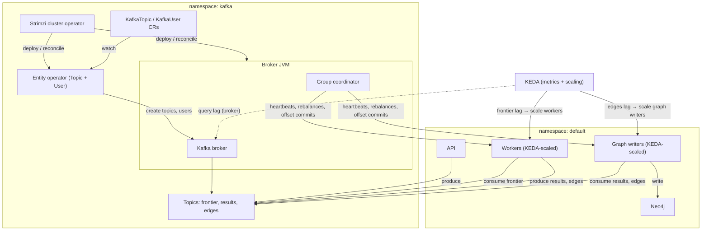

# Kafka (kind + Strimzi)

This project uses **kind** for local Kubernetes.

## Prerequisites

- Docker Desktop running
- Homebrew (macOS)

## Install Tools

```sh
brew install kind kubectl
```

## Create Cluster

```sh
kind create cluster --name relentless --config deploy/kubernetes/kind-config.yaml
```

## Verify

```sh
kubectl config current-context
kubectl get nodes
```

## Kafka Namespace and Strimzi

```sh
kubectl apply -f deploy/kubernetes/kafka/kafka-namespace.yaml
kubectl apply -f "https://strimzi.io/install/latest?namespace=kafka"
```

## Kafka Cluster and Topics

```sh
kubectl apply -f deploy/kubernetes/kafka/kafka-cluster.yaml
kubectl apply -f deploy/kubernetes/kafka/kafka-topics.yaml
kubectl get kafkatopic -n kafka
```

To verify topics from inside the broker pod:

```sh
kubectl exec -n kafka -it relentless-kafka-relentless-kafka-pool-0 -- \
  /opt/kafka/bin/kafka-topics.sh --bootstrap-server localhost:9092 --list
```

To read messages from a topic:

```sh
kubectl exec -n kafka -it relentless-kafka-relentless-kafka-pool-0 -- \
  /opt/kafka/bin/kafka-console-consumer.sh \
  --bootstrap-server localhost:9092 \
  --topic relentless.crawl.frontier \
  --from-beginning \
  --property print.key=true
```

## Configuration Notes

- **Kafka version**: `4.1.1` is required by the Strimzi operator currently
  installed; older versions are rejected by the CRD.
- **Node pools**: we use a single `KafkaNodePool` with one node that has both
  `broker` and `controller` roles for local development simplicity.
- **Replicas**: the cluster runs **1 broker** (node pool replicas = 1) and
  topics use **replicas = 1** because kind is single-node.
- **Partitions**: each topic uses **3 partitions** to allow some parallelism
  for producers/consumers during development.
- **Storage**: `ephemeral` is chosen for local dev; data is lost when pods
  restart. Use persistent volumes for real deployments.

## Broker limits and partition capacity

Broker resources are set in `kafka-cluster.yaml` on the **KafkaNodePool**:
memory request/limit 512Mi / 1Gi, CPU 500m / 1, JVM heap 256m–768m.

With these limits, keep **total partitions across all topics** in a conservative range to avoid coordinator overload and "Group Coordinator Not Available":

- **~100–300 total partitions**: generally safe.
- **~500 total partitions**: often fine; watch broker memory and readiness in Grafana (Kafka namespace panels).
- **1000+ total partitions**: higher risk on 1 CPU / 1Gi; consider increasing broker resources before scaling partitions further.

See `results/FAILURE_MODES.MD` for broker overload symptoms and mitigations.

## Architecture: how components interact



- **Data path:** API and workers produce to topics; workers consume frontier, graph writers consume results/edges and write to Neo4j. The broker hosts all topics; the **group coordinator** (same JVM as broker) handles consumer groups (heartbeats, rebalances, offset commits).
- **Strimzi:** Cluster operator deploys the broker and Entity operator. Entity operator watches KafkaTopic/KafkaUser CRs and reconciles with the broker (creates topics and users). Under load, Entity operator can fail to connect to the broker → CrashLoopBackOff; cluster operator can block on reconciliation.
- **KEDA:** Scales workers and graph writers from Kafka lag metrics (queried from the broker). If the broker or coordinator is overloaded, lag metrics and consumer throughput can both suffer.
