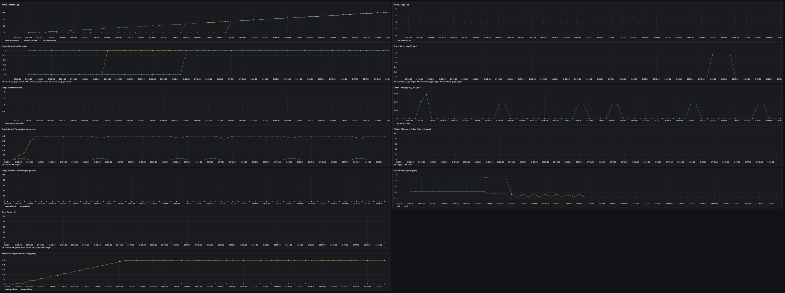
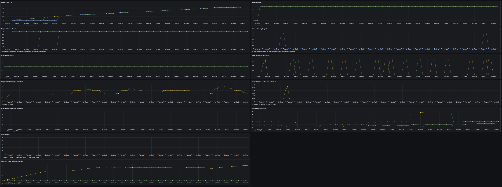
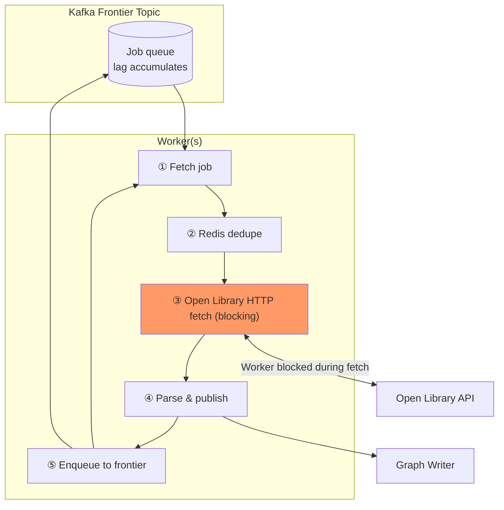

# Worker V1: Synchronous Fetch

Baseline: one job at a time per worker. Open Library HTTP fetch blocks the worker; each job enqueues many new jobs, so frontier expansion outpaces consumption and lag grows.

## Crawl Results: 1 Worker + 1 Graph Writer (Shakespeare)

**Analysis:** Data from this run indicates:

- Frontier lag grows from 1 → 158 over 16 min (~9.8/min); the single worker never catches up.
- Crawl throughput sparse and bursty (worker success mostly 0, occasional 0.03–0.07 jobs/s). Fetch latency p50 0.18–0.44 s, p95 0.24–0.93 s.
- Results ~0.004–0.007/s, edges ~0.49–0.50/s; both plateau after ~5 min. Error and skip rates 0; graph-writer lag 0.
- **Conclusion:** Bottleneck is worker throughput, not Neo4j. Adding workers is the right lever.

## Crawl Results: 2 Workers + 1 Graph Writer (Shakespeare)

**Analysis:** Data indicates:

- Frontier lag grows from 8 → 346 over 25 min (~13.5/min); lag growth higher than 1-worker (9.8/min)—more workers expand frontier faster.
- Edges ~0.99–1.54/s (~2× 1-worker). Fetch latency p50 0.18–1.30 s, p95 up to 4.7 s (Open Library contention). Graph-writer lag 0.
- **Conclusion:** 2 workers double throughput but lag still grows. Bottleneck remains worker throughput.

## Crawl Results: 3 Workers + 1 Graph Writer (Shakespeare)

**Analysis:** Data indicates:

- Frontier lag grows from 1 → 269 over 16 min (~16.8/min)—highest growth of the three runs. Brief plateau 06:14–06:21 (180–264).
- Edges ~0.09–2.63/s (~5× 1-worker). Fetch latency p95 4.0–4.2 s late run (Open Library contention; V1: 1 in-flight per worker).
- Graph-writer lag 0. **Conclusion:** 3 workers give ~5× throughput vs 1-worker but lag growth is highest; Open Library tail latency limits gains.

## Scaling summary

Same crawl (seed **Shakespeare**) at **1, 2, and 3 workers**. Duration and lag growth from run timestamps.

| Workers | Duration (min) | Max frontier lag | End lag | Lag growth (per min) |
|--------:|----------------|------------------|---------|----------------------|
| 1       | 16             | 158              | 158     | 9.8                  |
| 2       | 25             | 346              | 346     | 13.5                 |
| 3       | 16             | 269              | 269     | 16.8                 |

**Conclusion:** Worker throughput is constrained by Open Library fetch latency; graph-writer lag 0 → Neo4j not limiting. Edges 0.5 → 1.3 → 2.6/s scale 1→3; fetch p95 4–5 s at 3 workers blocks further gains. Each worker processes one job at a time; the HTTP fetch blocks the worker, so it cannot overlap I/O.

**Next:** Worker V2 adds concurrent fetch and an in-order commit coordinator to overlap fetches and scale throughput (see [**WORKER_V2_README.md**](WORKER_V2_README.md)).
