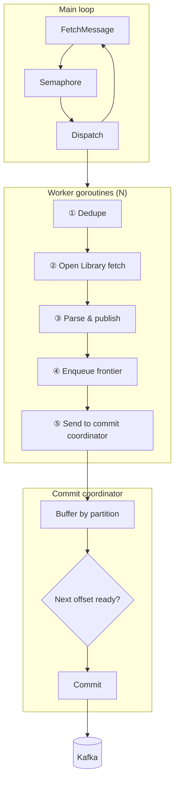
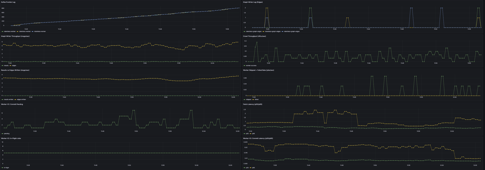

# Worker V2: Concurrent Fetch + Commit Coordinator

V2 overlaps up to CONCURRENT_JOBS (5) fetches per worker and uses an in-order commit coordinator so Kafka commits stay per-partition ordered (avoids duplicates on restart).

## Commit coordinator flow

## Crawl Results: 1 Worker + 1 Graph Writer (Shakespeare)

**Analysis:** Data indicates:

- Frontier lag grows from 4 → 825 over ~34 min (~24/min). Edges written ~3.5–4.5/s (plateau ~6 min)—**~8× V1** (~0.5/s).
- Fetch latency p50 0.27–0.39 s, p95 0.79–0.92 s. In-flight stays at 5 (CONCURRENT_JOBS); commit pending 1–4; commit errors 0.
- **Conclusion:** V2 concurrent fetches deliver ~8× edge throughput vs V1. Lag growth ~24/min; adding workers or tuning CONCURRENT_JOBS can improve further.

## Crawl Results: 2 Workers + 1 Graph Writer (Shakespeare)

**Analysis:** Data indicates:

- Frontier lag 10 → 1095 over ~34 min (~32/min). Edges ~8.5–9.5/s (plateau ~5–6 min)—~2× 1-worker V2.
- Fetch p95 1.5–1.7 s mid-run (Open Library contention, 2×5=10 parallel fetches). Graph-writer lag 0.
- **Conclusion:** 2 workers double edge throughput vs 1-worker V2; V2 2-worker ~6× V1 2-worker edges (8.5 vs 1.3/s).

## Crawl Results: 3 Workers + 1 Graph Writer (Shakespeare)

**Analysis:** Data indicates:

- Frontier lag 25 → 1155 over ~34 min (~33/min). Edges ~12.8–15.2/s (plateau ~14–15/s by ~20 min)—~1.7× V2 2-worker.
- Fetch p95 0.62–1.83 s; in-flight 5 per worker; commit errors 0.
- **Conclusion:** V2 3-worker ~5× V1 3-worker edges (15 vs 2.6/s) due to concurrent fetches.

## Scaling summary

Same crawl (Shakespeare), V2 worker. Edges/s = plateau rate; ramp = time to plateau.

| Workers | Concurrent | Dur (min) | Max lag | Lag/min | Edges/s | Ramp (min) |
|--------:|------------|-----------|---------|---------|---------|------------|
| 1       | 5          | 34        | 825     | 24.0    | 4.0     | ~6         |
| 2       | 5          | 34        | 1095    | 32.0    | 9.0     | ~5–6       |
| 3       | 5          | 34        | 1155    | 33.2    | 15.0    | ~20        |

### V1 vs V2 edges/s

| Workers | V1 edges/s | V2 edges/s | V2 vs V1 |
|--------:|-----------:|-----------:|----------|
| 1       | ~0.5       | ~4         | **~8×**  |
| 2       | ~1.3       | ~9         | **~7×**  |
| 3       | ~2.6       | ~15        | **~5–6×**|

**Conclusion:** V2 (concurrent fetch + commit coordinator) gives ~5–8× edges/s at each worker count. Next step: scale workers with KEDA on frontier lag (see [**WORKER_V3_AUTOSCALE_README.md**](WORKER_V3_AUTOSCALE_README.md)).
