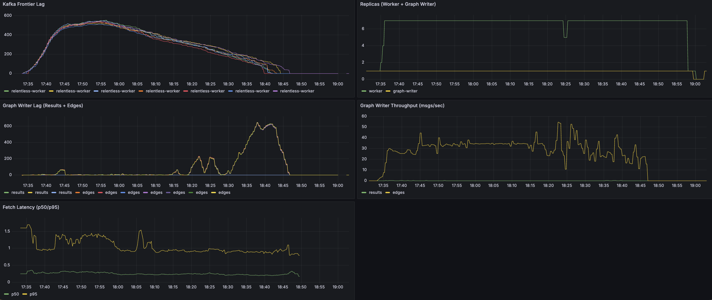
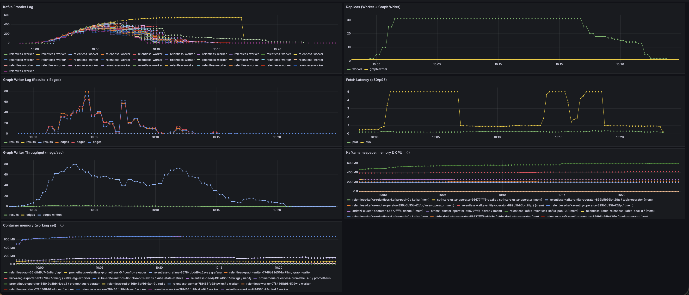

# Worker V3: Autoscaling (KEDA)

KEDA scales workers (and optionally graph writers) on Kafka lag. Workers use V2 (concurrent fetch + commit coordinator).

## Crawl Results: Autoscaled Workers + 1 Graph Writer, Single Seed (Shakespeare)

**Analysis:** Data indicates:

- Frontier lag grows ~8 → ~3500 over ~50 min, then drains to 0 by ~13:32—**crawl completed**. KEDA scales workers 1 → 2 → 4 → 7 within ~2 min; holds 7 for ~2.5 h; scale-down 7 → 1 as lag clears.
- Edges ~15–16/s (plateau ~5 min); matches V2 3-worker fixed. Fetch latency and in-flight as in V2; graph-writer lag 0; error rates 0.
- **Conclusion:** KEDA drives worker count from frontier lag; throughput matches V2 fixed; crawl completes with lag 0.

## 14 Workers + 7 Graph Writers, Single Seed (Shakespeare) — 4G node

**Setup:** 14 frontier partitions, 7 edge partitions, max 14 workers + 7 graph writers, **4G Kind node**.

**Analysis:** Data indicates workers scale 1 → 14 by ~06:28; graph writers 1 → 7 by ~06:30. Frontier lag peaks ~250–290/partition; **frontier lag → 0** for most partitions by ~07:04 (**~45–53 min**). Edges lag builds to ~2.5k–3.9k/partition then drains to 0 by 07:03:45. No Neo4j/KEDA issues in this run. (That one graph writer can be sufficient at 8G is shown by the 14+14 increased-mem run below.)

## 14+14 Workers + Graph Writers (4G node) — Neo4j OOM, KEDA Crash-Loop

**Setup:** 14 frontier + 14 edge partitions, max 14 workers + 14 graph writers, single seed, **4G Kind node**.

**Analysis:** Data indicates workers → 14 by 09:34; graph writers → 14 by ~10:17. Frontier lag → 0 at ~10:26 (~60 min). Edges lag 0 → ~900–1074 then stalled ~600–2600+ (09:48–10:26); graph-writer errors spike 09:47–10:08. **Neo4j OOMKilled** (no limits; 14 writers → exit 137). After setting Neo4j memory limits (512Mi request, 1Gi limit, JVM heap cap) and restart, edges lag drained to 0 by 11:33 (~2 h 6 min total). **KEDA:** Edges lag → 0 but graph-writer replicas stayed at 14 (no scale-down). HPA `TARGETS <unknown>`, `FailedGetExternalMetric`—KEDA operator crash-looping (node overcommit ~128% memory; operator OOM-starved).

**Fixes applied:** Neo4j: `requests.memory: 512Mi`, `limits.memory: 1Gi`, JVM heap 256m/512m. Node: increase Kind node to 6–8 Gi to avoid overcommit; optionally reduce KEDA component limits.

## 14+14 Workers + Graph Writers, 8G Node (Increased Memory)

**Setup:** Same 14+14, single seed Shakespeare, **Kind node 8G**, Neo4j/Grafana limits applied.

**Analysis:** Data indicates workers 1 → 14 by 15:11:45; **graph writer stays at 1** (never scaled up). Frontier lag → 0 at **15:45:45** (**~38 min**). Edges lag 0 or low throughout; single writer sustained ~68–69 edges/s—enough to consume 14 workers’ output. Neo4j ~572–640 MB (under 1Gi); no errors.

**Conclusion:** With 8G node, Neo4j and KEDA stable; one graph writer suffices so edges lag never exceeds KEDA threshold.

| Run                       | Frontier lag → 0 | Edges lag    | Graph-writer replicas |
|---------------------------|------------------|--------------|------------------------|
| 14+14 increased_mem (8G)  | **~38 min**      | 0 throughout | 1 (no scale-up)        |
| 14+7 (4G)                 | ~45–53 min       | 46 min to 0  | 7 → scale-down         |
| 14+14 unbounded (4G)      | ~60 min          | 2 h to 0     | 14 (no scale-down)     |

## 3-Seed and 10-Seed Runs

**Seeds:** 3-seed (Shakespeare, Milton, Woolf); 10-seed adds Pratchett, Le Guin, Asimov, Pamuk, Dumas, Tolstoy, Murakami.

Worker memory is per-replica and does not scale with seed count; graph writers were underutilized (edges lag low). See [**RESOURCE_BUDGET_8G.md**](RESOURCE_BUDGET_8G.md) (remainder for workers+graph writers, max 32 combined at 64Mi each) and [**FAILURE_MODES.MD**](FAILURE_MODES.MD) (Neo4j OOM, KEDA crash-loop, mitigations).

## Scaling Strategy and 10-Seed, 31 Workers + 1 Graph Writer

**Strategy:** Start worker-heavy (31 workers, 1 graph writer); monitor edge lag. If edge lag grows, rebalance (fewer workers, more graph writers) within workers + graph_writers ≤ 32 (see [RESOURCE_BUDGET_8G.md](RESOURCE_BUDGET_8G.md)).

**10-seed, 31w+1gwr:** Data indicates workers scale to 31; graph writer stays 1. Edge lag peaks ~2.9k/partition (~8.7k total) then drains to 0 in ~4 min. Single writer sufficient. Scale writers only if edge lag stays high or for SLA/drain-time goals.

## 20-Seed: 31w+1gwr vs 28w+3gwr vs 26w+5gwr

**Trend:** As graph writers increase (1 → 3 → 5) and workers shift (31 → 28 → 26) with total ≤ 32, Neo4j memory, Kafka broker load, and edge lag worsen. At 26w+5gwr: Neo4j ~981 MB (1Gi cap), edge lag 13k–14k/partition and never drains; Strimzi/Entity Operator issues (see [FAILURE_MODES.MD](FAILURE_MODES.MD) §5). **31w+1gwr** is best for this 20-seed 8G setup: Neo4j headroom, edge lag 0, Kafka moderate. Recommendation: keep total replicas ≤ 32; prefer few graph writers (1–2); scale writers only if edge lag remains high and Neo4j/Kafka show headroom.

## Latest 20-Seed, 31w+1gwr (All Fixes)

After mitigations in [FAILURE_MODES.MD](FAILURE_MODES.MD) (requeues on commit failure, Kafka/Neo4j resources, reduced cluster load), edge lag stays negligible; one graph writer drains the edges topic.

**Next:** Chaos testing (worker/graph-writer/Neo4j/Kafka failure, network chaos) under 20-seed 31w+1gwr is in [**WORKER_V3_CHAOS_README.md**](WORKER_V3_CHAOS_README.md). Multi-egress (proxy pool) to reduce Open Library rate-limit impact is in [**WORKER_V4_MULTIPLE_EGRESS_IP**](WORKER_V4_MULTIPLE_EGRESS_IP.md).
