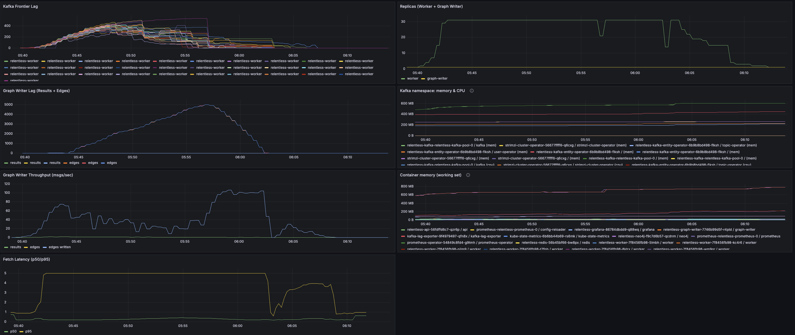
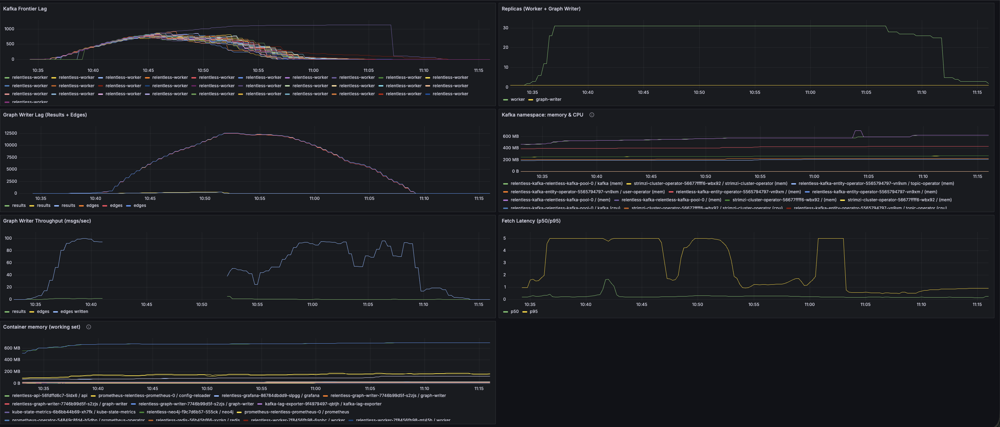
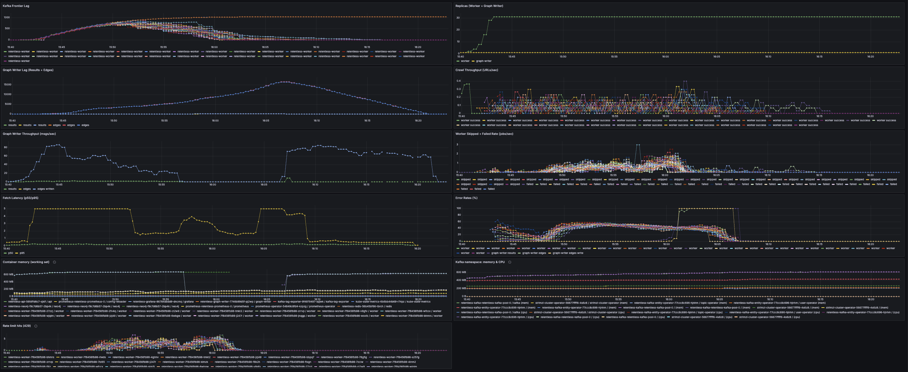
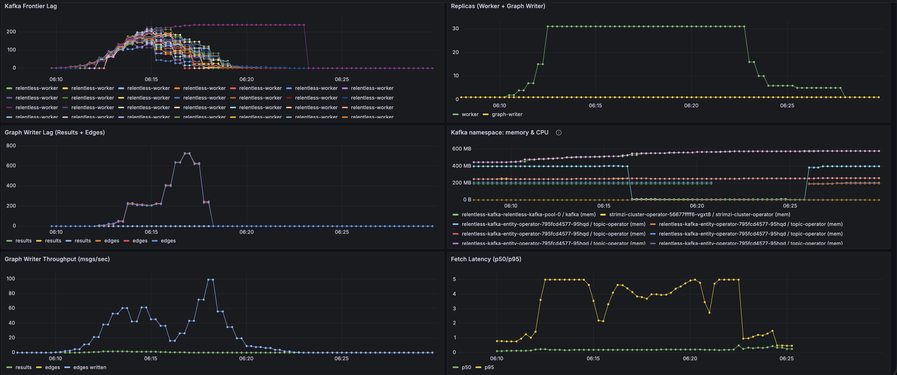

# Worker V3: Chaos Testing

Chaos runs use 20 seeds, 31 workers (max), 1 graph writer. Manifests under `deploy/kubernetes/chaos-mesh/`; see [deploy/kubernetes/chaos-mesh/README.md](../deploy/kubernetes/chaos-mesh/README.md) for apply/remove and standalone delay/loss.

## Worker pods killed in sequence

**Workflow:** Kill 1 → wait 5m → kill 5 → wait 5m → kill 10 → wait 5m → kill all. Remove workflow when done.

**Observed:** Replica counts align with chaos (e.g. worker count dips to 21 then 14 at kill-10 and kill-all); back to 31 between steps. Graph writer remained 1. After workflow end, workers scale down as frontier drains. Frontier lag in hundreds during chaos; no sustained error spike. System recovered to full worker count between steps and scaled down cleanly.

## Graph writer down (10 min)

**Chaos:** PodChaos `pod-failure` on the single graph-writer pod, 10 min.

**Observed:** Replicas unchanged (31 workers, 1 graph writer). Results lag ~0 → ~276–309; edges lag ~326 → ~12,185–12,209 during failure. Graph-writer throughput effectively zero for ~11 min. After chaos end, results and edges lag drain. Confirms single graph writer as critical path. (High frontier lag on one partition was traced to HTTP 429 from Open Library, not a stuck worker.)

## Network chaos: delay then loss (workers → Open Library)

**Workflow:** 5 min 5s latency workers→Open Library, then 5 min suspend, then 5 min 100% packet loss.

**Observed:** Fetch latency p50 ramped to 5 s during delay and again during loss; returned to normal after each phase. Frontier lag drained to 0 by ~15:03 (~35 min total). Edge throughput fell during delay (e.g. ~69 → ~5–7 edges/s); edge lag grew to ~4923. During 100% loss throughput dropped to 0; after chaos end throughput and lag recovered. Rate-limit hits non-zero during delay, 0 during loss (workers unreachable). Worker error rate elevated during delay and loss (proxy for DLQ volume); frontier eventually drained to 0.

## Neo4j down (10 min)

**Chaos:** PodChaos `pod-failure` on Neo4j pod, 10 min.

**Observed:** Graph-writer edges throughput dropped to 0 for the failure window; edge lag grew to ~16.6k/partition. After Neo4j recovery, lag drained to 0 by ~16:21. Graph-writer error rate 90–100% during failure. Some frontier partitions showed stuck lag; **commit_pending_total** (two pods ~1042–1043 vs 0–10 on others) confirmed the stuck-partition failure mode in [FAILURE_MODES.MD](FAILURE_MODES.MD) §6 (publish-timeout hardening addresses this).

## Kafka broker down (10 min)

**Chaos:** PodChaos `pod-failure` on one Kafka broker pod, 10 min.

**Observed:** Broker CPU dropped during failure (e.g. ~295–396 mB → ~60–90 mB); memory stable (pod present). Frontier lag dropped (most partitions 0 by 06:19; one partition 240 until 06:23). Edge lag spiked then 0; graph-writer throughput → 0 by 06:23 through broker down. After broker recovery, metrics show renewed activity. Confirms Kafka broker as critical path.

**Next:** Multi-egress (proxy pool) to reduce Open Library per-IP rate limits and stuck-partition behavior: [**WORKER_V4_MULTIPLE_EGRESS_IP**](WORKER_V4_MULTIPLE_EGRESS_IP.md).
