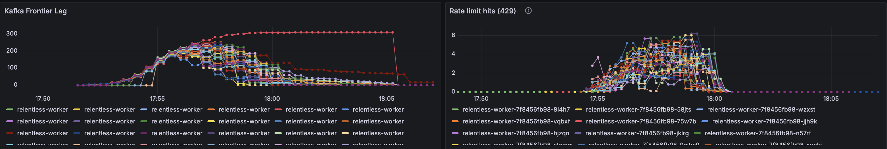
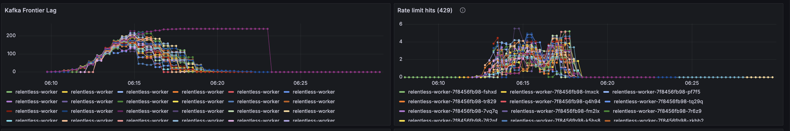
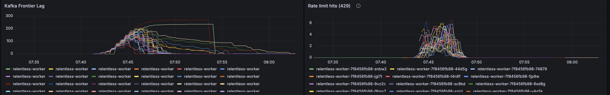
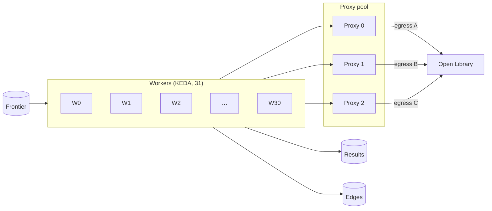
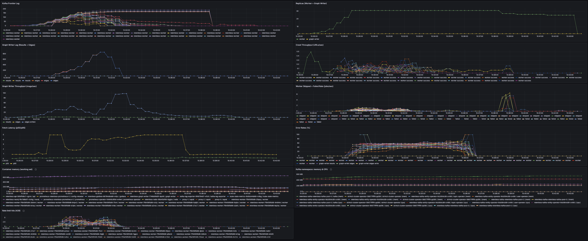

# Worker V4: Multi-Egress IP (Proxy Pool)

## Problem: Rate Limits Cause Stuck Partitions

When workers share a single egress IP, Open Library’s per-IP rate limits are hit quickly (see [**FAILURE_MODES.MD**](FAILURE_MODES.MD) §7 for how rate limits work). The consumer for a frontier partition makes all requests from that worker’s IP; a burst of URLs triggers HTTP 429 and backoff. Progress on that partition stalls until retries or timeouts (DLQ). **A few partitions** show **high, flat frontier lag** for a long time while others drain; overall crawl completion is delayed.

Screenshots (20 seeds, autoscaled workers, single egress): `raw_data/metrics/worker_with_autoscaler/20_seed_rate_limit_hit_tracking/screenshots/`.

**Overview 1** — Frontier lag: several partitions drain; one or more stay elevated (stuck partition from rate limiting).

**Overview 2** — Rate-limit (429) hits align with the window where affected partition(s) lag is flat.

**Overview 3** — Stagnant lag and rate-limit hits correlate; once limits back off or jobs time out, that partition advances.

**Takeaway:** Single egress → per-partition progress gated by per-IP limits. Spreading traffic across multiple egress IPs (proxy pool) reduces stagnation and speeds drain.

## Solution: Proxy Pool

Workers use a **proxy pool** (PROXY_POOL: comma-separated URLs). Each worker pod picks one proxy by hashing HOSTNAME, so traffic spreads across egress IPs. KEDA maxReplicas 31; with 3 proxies, ~10 workers per proxy.

## Architecture

Proxy selection: `hash(HOSTNAME) % len(PROXY_POOL)` → deterministic proxy per pod.

## Configuration

- **Worker env:** `PROXY_URL` (single) or `PROXY_POOL` (comma-separated). Helm `values.yaml` or deployment `env`.
- **KEDA:** `maxReplicaCount: 31` in `deploy/kubernetes/keda/scaledobject-worker.yaml`.
- **Proxy pool:** Set `PROXY_POOL` (e.g. `http://proxy-0.proxy:3128,http://proxy-1.proxy:3128,http://proxy-2.proxy:3128`). See [deploy/kubernetes/keda/README.md](../deploy/kubernetes/keda/README.md).

---

## Run Analysis (Proxy Pool Enabled)

**Run:** 20 seeds, 3 egress proxies, KEDA worker scaling. Screenshot: `raw_data/metrics/worker_autoscaler_egress_proxy/20_seed_3_proxies/screenshots/overview.png`.

**Analysis:** Data indicates:

- **Frontier lag:** Run starts ~10:25; lag builds to peaks ~50–190 by 10:31. Most partitions drain to 0 by ~10:33–10:36; several (e.g. 8, 9, 11, 15, 17, 18, 27) stay at 166–190 until 10:38:30 (stuck tail from rate limiting). All 32 partitions reach 0 by 10:38:45–10:42. **Total crawl-to-drain ~17 min**—faster than single-egress runs (20–40+ min).
- **Rate-limit hits:** Per-worker metrics show 0 or very low hits in the 10:33–10:38 window; 3 proxies avoid concentrated per-IP 429s and let the stuck tail clear sooner.
- **Replicas:** Workers scale 1 → 2 → 4 → 7 → 15 → 22 → 31 by 10:28:30; scale down (27 → 25 → 1) as lag drains. Graph writer stays 1.
- **Graph writer throughput:** Edges/s ramp to ~32 by 10:28; sustained; taper as lag clears.

**Takeaway:** With 3 egress proxies and PROXY_POOL, frontier lag drops to zero faster than single-egress. A subset of partitions still shows temporary stuck lag (166–190); the pool shortens the tail; all partitions drain within ~17 min.

We cap at **3 proxies** on the 8G Kind node: the resource budget ([**RESOURCE_BUDGET_8G.md**](RESOURCE_BUDGET_8G.md), §6a) leaves 2048 Mi for workers + graph writers only after allocating for 3 proxies (384 Mi each). More proxies would shrink that remainder and cap combined replicas (e.g. 4 proxies ⇒ max 26); 3 is the chosen trade-off for multi-egress without reducing worker scale.
